# AZ MLops Project

This project implements a machine learning task using services offered by Microsoft Azure.
The focus of the project is less on the machine learning aspect itself but more on getting the model into production.
More specifically, using a bank marketing dataset a model is specified using an AZ AutoML pipeline to classify bank clients.
Thereafter the trained model is deployed and published.

## Architectural Diagram

- The architectural diagram.
- Using the AZ platform to compute a model, the most accurate is subsequentely deployed via AZ Container Instances.
- The Container Instance itself can be triggered via REST API requests.

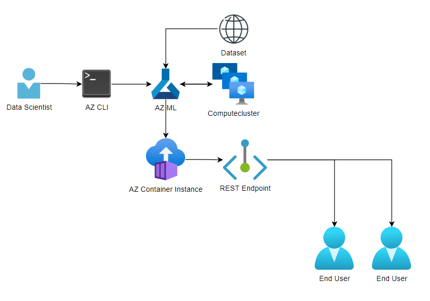

## Key Steps

### Authentication

- Making sure that the pipline runs without interruption, ensure that proper authentication settings are calibrated.

- Working on a VM provided by Udacity, this step was already fulfilled.

### Dataset registeration

- In order to calculate a model, Azure must have access to data.

- Using the specified Bank dataset URL, the underlying data was registered in AZ ML as you can see below:

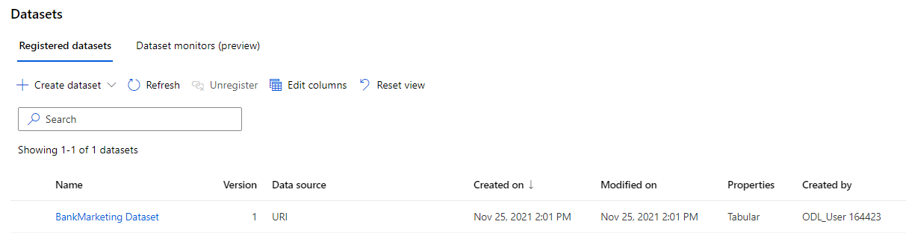

### AutoML Model

- Relying on Az AutoML, a classification model was trained.

- AZ AutoML provides a way to utilize a variety of preprocessing steps & models.

- The most accurate model for the task was a Voting Ensemble scoring a weighted AUC of roughly .94 as displayed below:

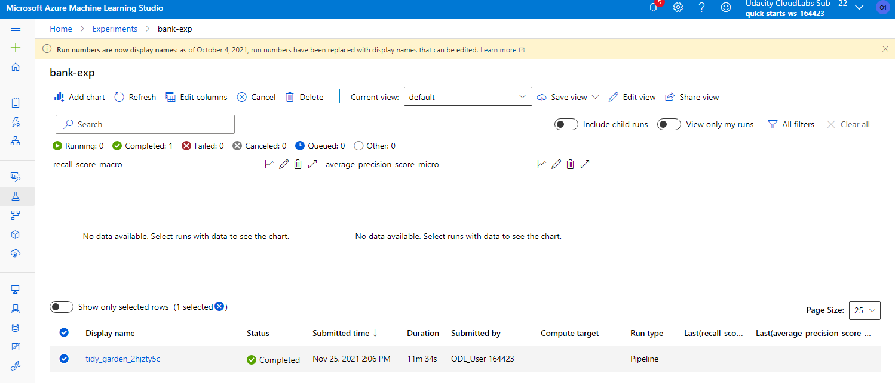
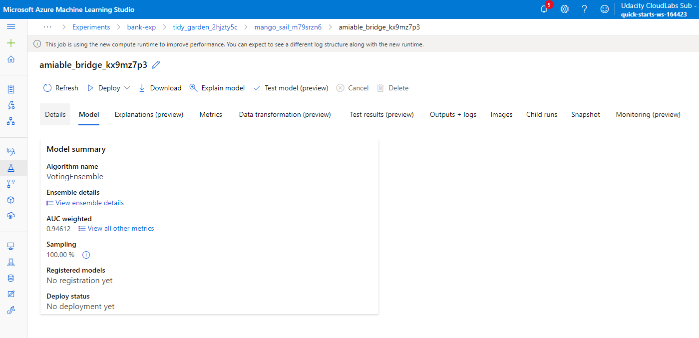

### Deploy the best model

- Having selected the best model, the Voting Ensemble was deployed on an Azure Container Instance making predictions via REST requests possible.

- To track the service, AppInsights was enabled.

- Below you find more details on this process:
    - authentification was enabled,
    - details on how to reach the endpoint are provided and
    - application insights are turned on.

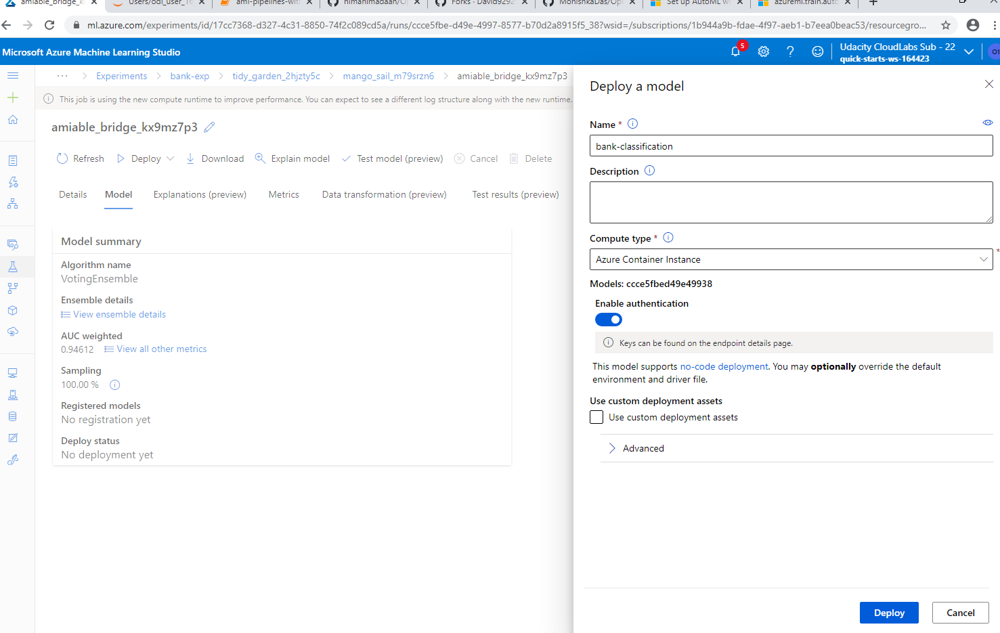
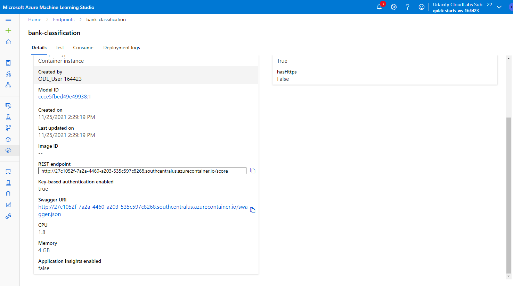
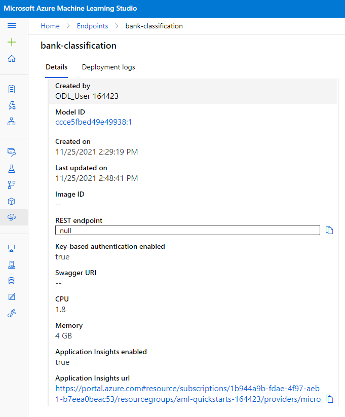

### Enable Logging

- Additionally, logging was enabled to further track the health of the deployed service.

- Below, an example for a successful log-request to a container mounted on AZ can be seen:

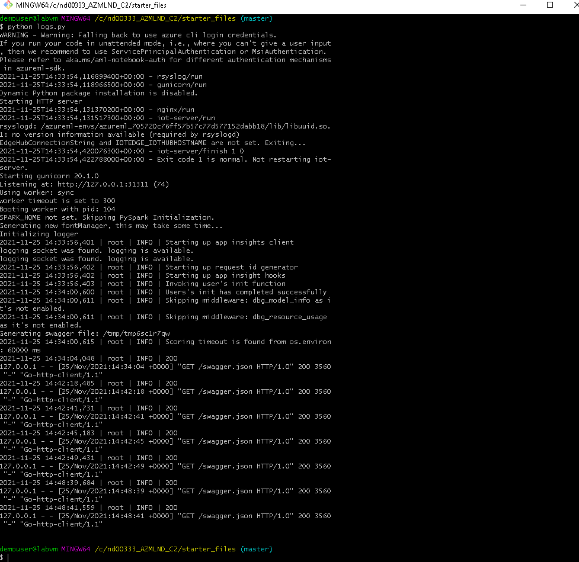

### Swagger Documentation

- In order to document the service's API usage, Swagger was utilized using a shell and python.

- Swagger is often times used to provide documentation on the usage of a API.

- For example, as displayed below, one can get information on how to correctly make requests to the underyling API service.

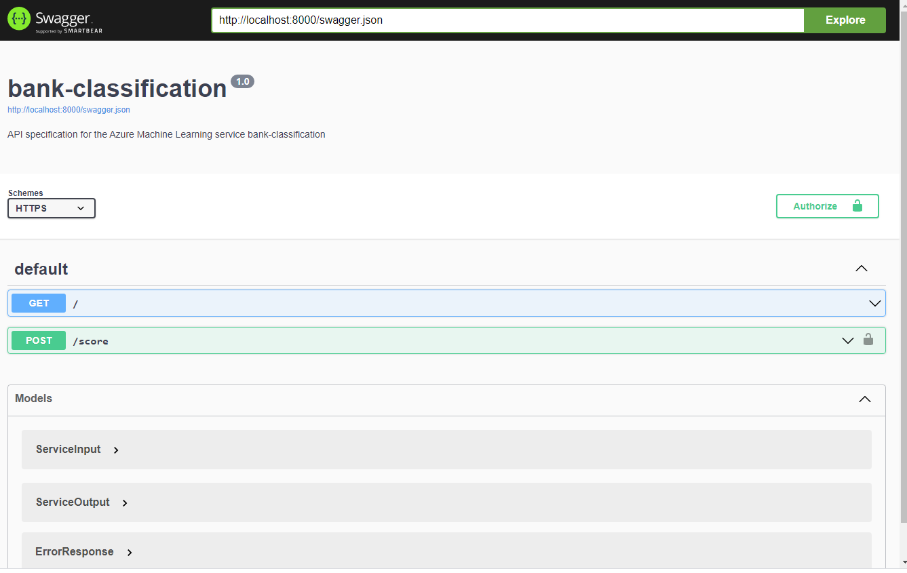

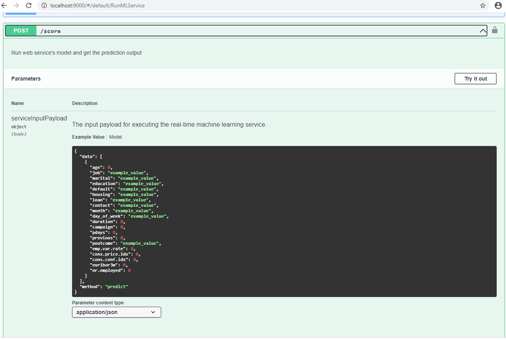

### Consume model endpoint

- After deployment the model could successfully be consumed using a .py script which sent a request to the specified model & returned 2 classifications for two individuals.

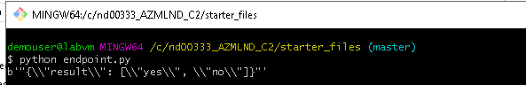

### Create and Publish a pipeline

- The above was achieved relying on an Azure pipeline built in python relying on the AZ SDK.

- A pipleline is a way of connecting subsequent steps in a data project.

- Notice, that the pipeline is running...

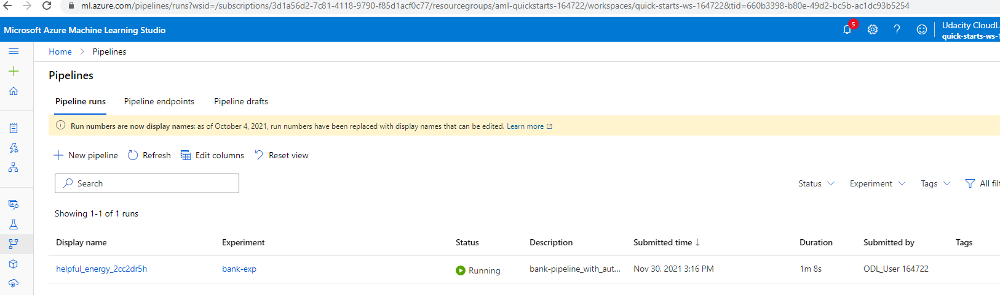

- Subsequentely, the pipeline's been published.

- The endpoint is useable as given by its Active Status:

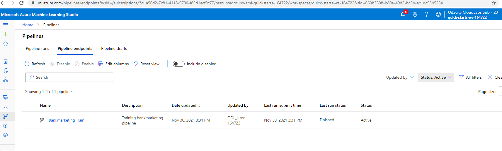

- Computing each step of the pipeline takes some time.

- While a pipline is beeing executed, one can therefore get information of its current status.

- To do so, one can either have a look at the current state programmatically relying on the Run Widget method:

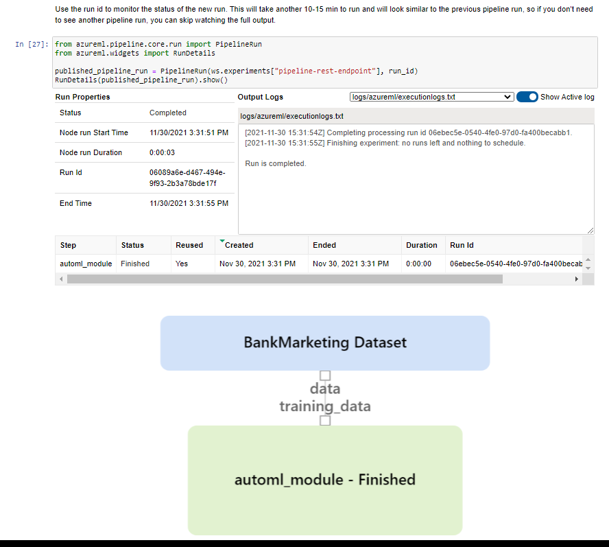

- Or one might make use of easy-to-digest UI AZ ML offers via AZ ML Studio:
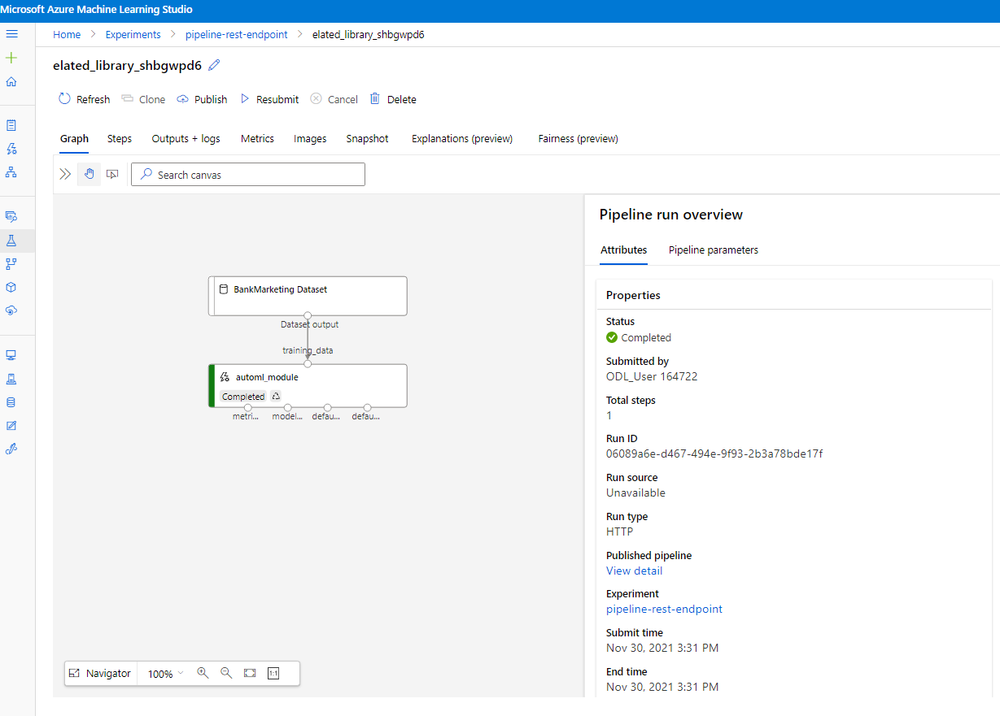

## Further improvements
- To further improve upon the project, one might take a closer look at the classification itself. Class imbalance is an issue to be sorted, for one. Furthermore, using deep learning inspired classification methods in order to increase accuracy might be worth the effort.

## Screen Recording

- The demanded demo of a working pipeline and respective endpoint is accessible under:
https://youtu.be/uacsX7S1S40
