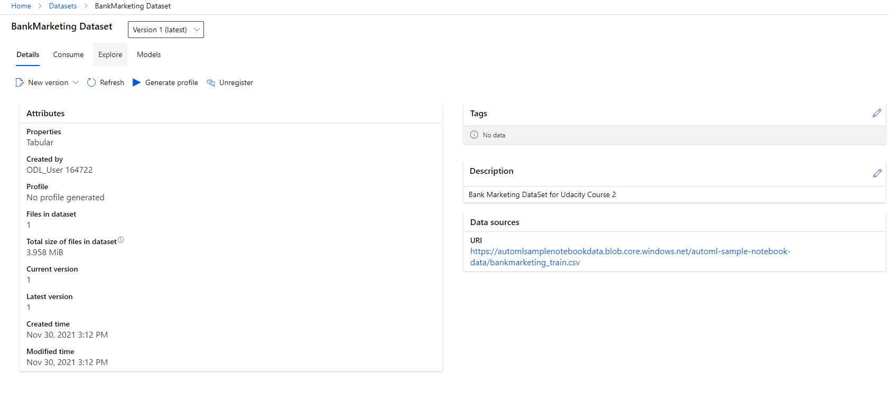

# AZ MLops Project

This project implements a machine learning task using services offered by Microsoft Azure.
The focus of the project is less on the machine learning aspect itself but more on getting the model into production.
More specifically, using a bank marketing dataset a model is specified using an AZ AutoML pipeline to classify bank clients.
Thereafter the trained model is deployed and published.

## Architectural Diagram

## Key Steps

### Authentication

- Making sure that the pipline runs without interruption, ensure that proper authentication settings are calibrated.

- Working on a VM provided by Udacity, this step was already fulfilled.

### Dataset registeration

- Using the specif Bank dataset URL, the underlying data was registered in AZ ML

### AutoML Model

- Relying on Az AutoML, a classification model was trained.

- The most accurate algorithm on the task was a Voting Ensemble scoring a weighted AUC of roughly .94.

### Deploy the best model

- Having selected the best model, the Voting Ensemble was deployed on an Azure Container Instance making predictions via REST requests possible.

- To track the service, AppInsights was enabled

### Enable Logging

- Additionally, logging was enabled to further track the health of the deployed service.

### Swagger Documentation

- In order to document the service's API usage, Swagger was utilized using a shell and python.

### Consume model endpoint

- After deployment the model could successfully be consumed using a .py script.

### Create and Publish a pipeline

- The above was achieved relying on an Azure pipeline built in python relying on the AZ SDK.

- The pipeline endpoint is marked as Active.

- Status of Run Widget, after publishing the pipeline as well as the dataset & ML studio view:

## Further improvements
- To further improve upon the project, one might take a closer look at the classification itself. Class imbalance is an issue to be sorted, for one. Furthermore, using deep learning inspired classification methods in order to increase accuracy might be worth the effort.

## Screen Recording

- The demanded demo of a working pipeline and respective endpoint is accessible under:
https://1drv.ms/u/s!AiadUpq8cnYngR2oCdK3KqbrhUEE?e=iBc3NS
